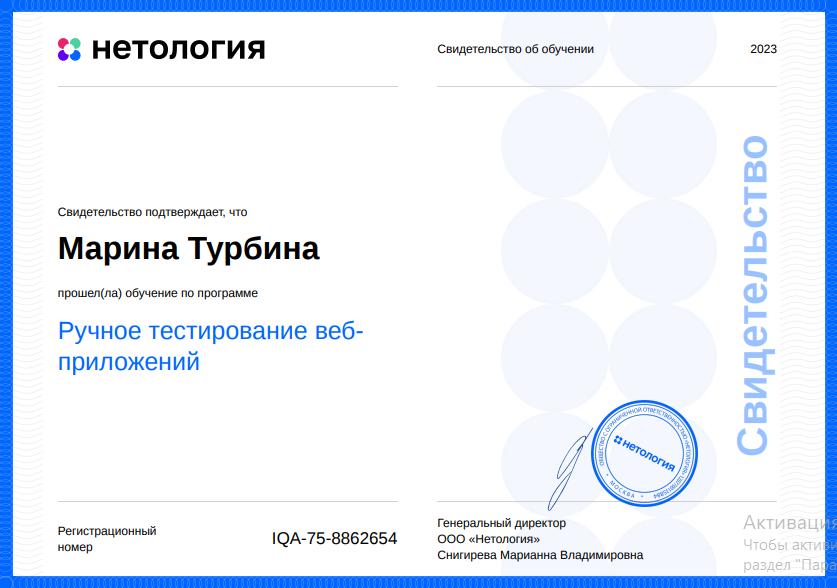
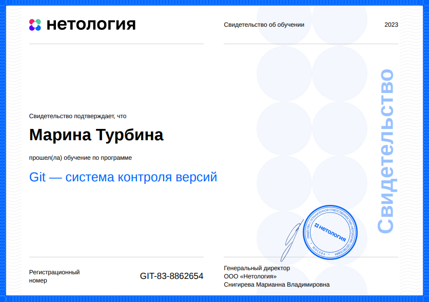
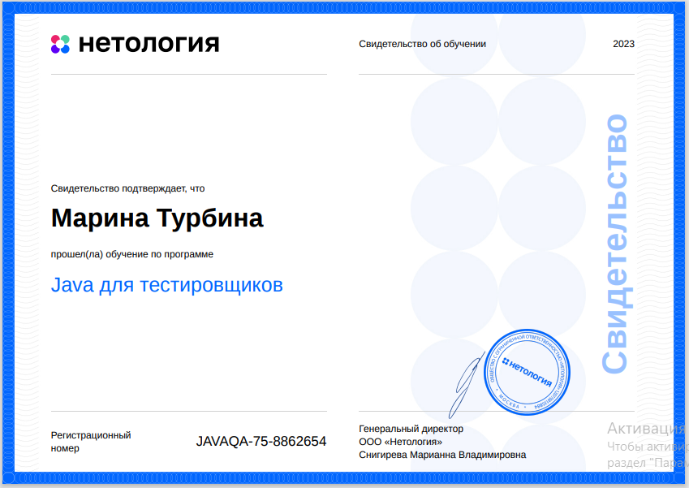
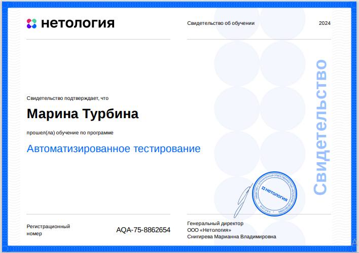
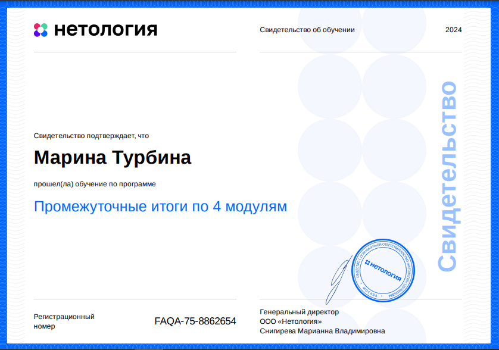
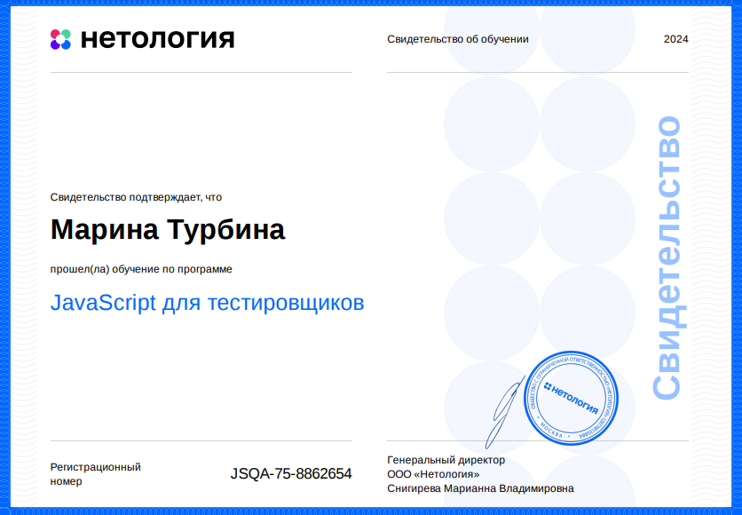
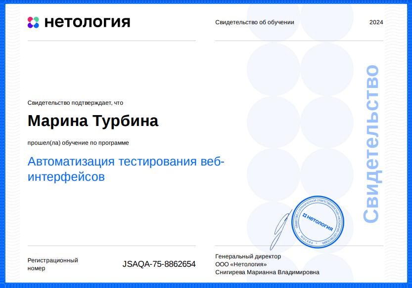

# Нетология. Программа профессиональной переподготовки «Инженер по тестированию: расширенный курс»

## Успешно пройдены модули:

- _Ручное тестирование веб-приложений_ 
  
  

- _Работа в системе Git_
  
  

- _Java для тестировщиков_
  
  

- _Автоматизированное тестирование_

- _Курсовая работа по 4м пройденным модулям_

- _JavaScript для тестировщиков_
  
  

- _Автоматизация тестирования веб-интерфейсов_

